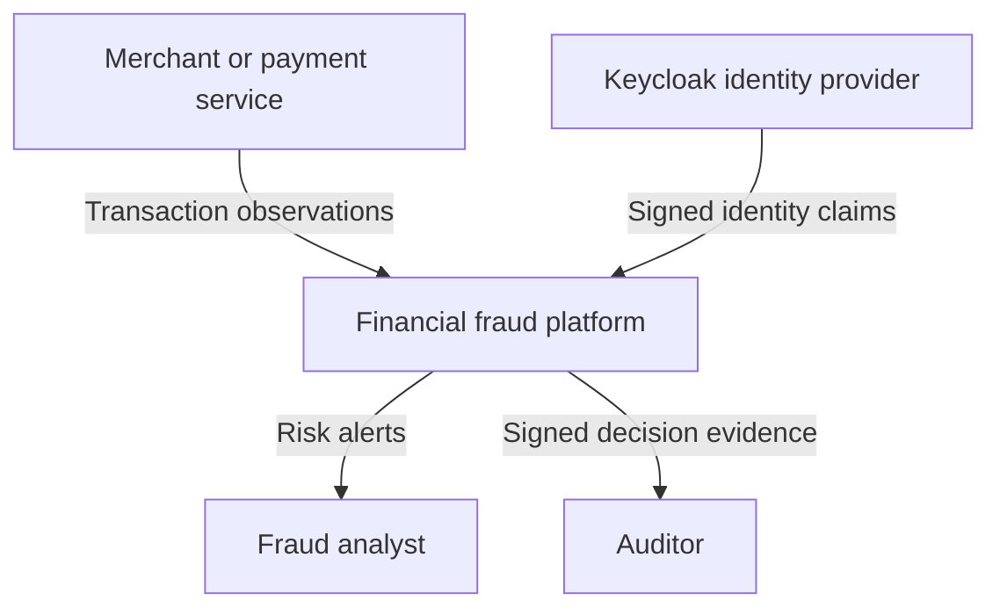
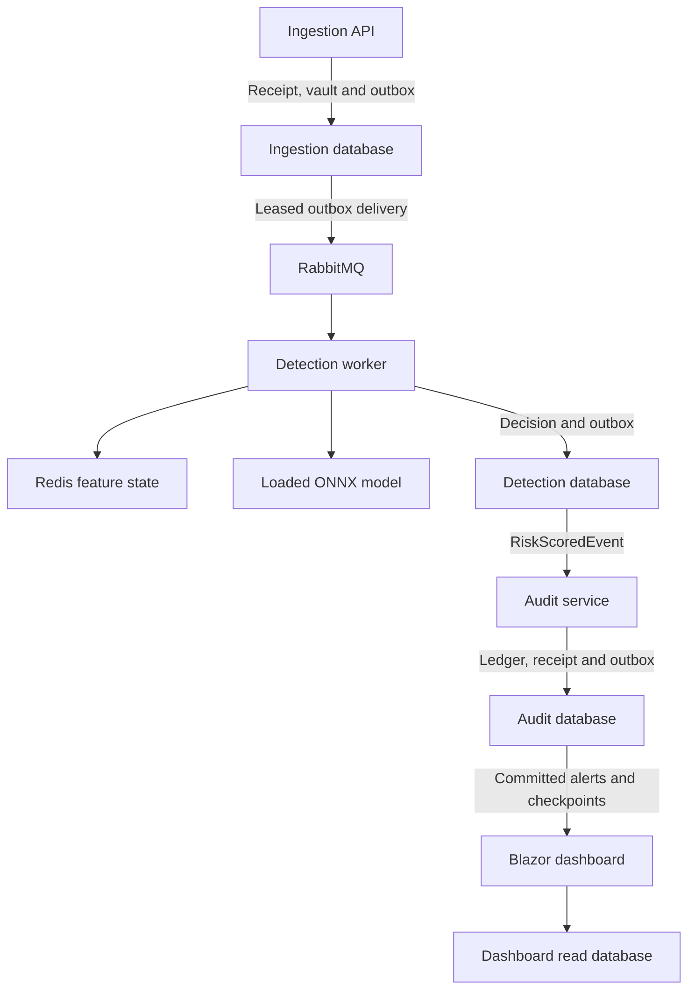
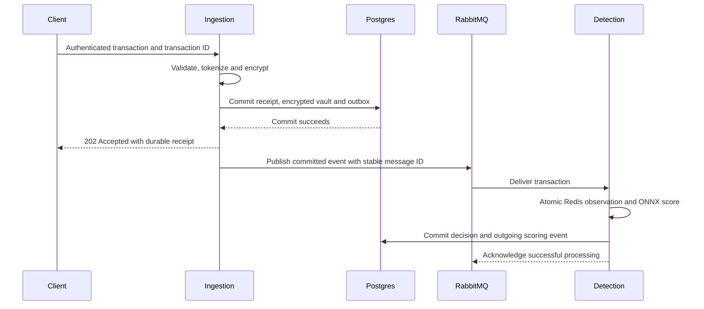
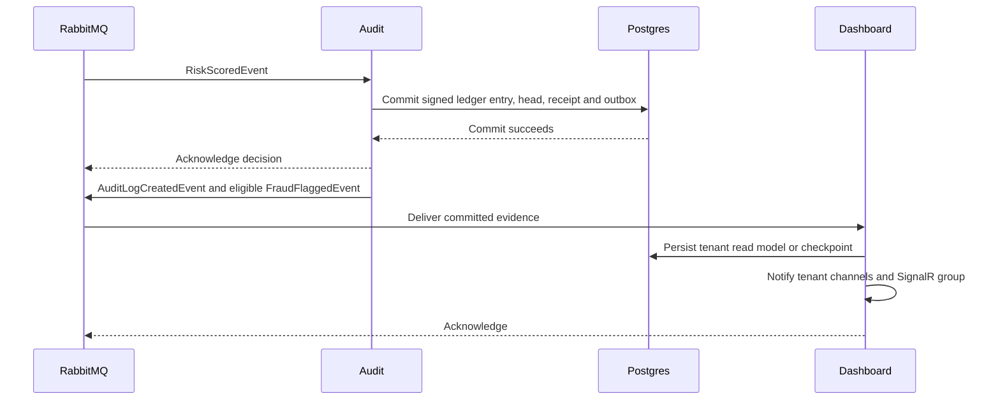

# Architecture

## Purpose and boundaries

The platform accepts authenticated transaction observations, produces a fraud score and preserves evidence for analyst review. It does not move money, approve or decline payments, file regulatory reports, perform sanctions screening or substitute for a compliance program. “Autonomous” describes the ingestion-to-audit processing path, not unrestricted financial decision-making.

All requested service projects are implemented. An application layer and four executable tools are added to keep domain dependencies isolated and operational tasks executable. The source contains no unimplemented-method stubs.

## C4 level 1 — system context

The merchant is authenticated independently from analysts. Tenant identifiers are taken only from validated claims. HTTP request bodies and gRPC messages have no authority to select a tenant.

## C4 level 2 — containers

The final two event deliveries also pass through RabbitMQ; those bus edges are collapsed to keep the diagram readable. PostgreSQL runs as one local server with five separate databases and roles, including Keycloak. A production deployment may separate servers without changing the contracts.

## C4 level 3 — components and dependency direction

| Boundary | Components | Responsibility |
| --- | --- | --- |
| Domain | Transaction, Money, CardNumber, TransactionId, GeoPoint | Invariants and domain events; no database, messaging or HTTP dependency |
| Application | SubmitTransactionHandler, GetTransactionHandler, ITransactionRepository | CQRS command/query boundaries using MediatR |
| Ingestion adapters | REST endpoints, GrpcGateway, BinaryTransactionParser, TransactionRepository | Protocol adaptation, claim-derived tenancy and atomic acceptance |
| Security | KeyRing, AesPayloadProtector, CardTokenizer, AuditSigner, SafeLogProvider | Versioned keys, encryption, pseudonyms, integrity and safe output |
| Event bus | OutboxEnvelope, OutboxDispatcher, Infrastructure | Persisted publication intent, optimistic leases, RabbitMQ setup and telemetry |
| Detection | RedisFeatureStore, FeatureMath, OnnxFraudScorer, DetectionConsumer | Atomic observation, model validation and durable decisions |
| Audit | AuditConsumer, LedgerHead, LedgerVerifier, AppendOnlyGuard | Chained records, duplicate protection, signed evidence and mutation rejection |
| Dashboard | AlertConsumer, AuditCheckpointConsumer, AlertsQueryHandler, AlertFeed, AlertsHub | Tenant-filtered read models and live UI notifications |

C4 level 4 is represented by the actual class interfaces and records in the source rather than a second, divergent class diagram. See the project map for paths.

## Acceptance and scoring sequence

The two PostgreSQL operations target separate service-owned databases. A 202 response means acceptance is durable; it does not mean scoring or audit has completed. A failed or unknown decision is never represented as a Low score.

## Audit and analyst sequence

## Transaction and delivery guarantees

1. Ingestion idempotency is scoped by tenant plus transaction UUID. A versioned keyed fingerprint covers normalized input, including the private name. New fingerprints use integer minor units; legacy receipts preserve their original fingerprint format. Equal retries return the original receipt; a changed payload returns 409. Retries are checked before the live event-time rule so an already accepted observation remains retrievable.
2. A Marten session commits documents and outgoing envelopes together. The outbox uses optimistic document concurrency to acquire a 60-second lease. Publishing has a 15-second cancellation budget and a stable MessageId. Delivery and the subsequent database update cannot be one transaction; a crash between them may cause a duplicate.
3. Detection has a durable per-transaction receipt and a cached Redis feature snapshot bound to the full event digest. A cached same-card transaction with a changed payload or an unverifiable legacy snapshot is rejected before updating feature state. Concurrent or retried delivery can run inference more than once, but only one accepted database decision is committed. Failed competing commits are retried by MassTransit.
4. Audit stores the decision, deduplication receipt, ledger head and outgoing events atomically. The head uses optimistic concurrency so the event chain cannot fork through ordinary application races.
5. Alerts are emitted after audit commit. Dashboard notifications are transient. A reconnect and the UI's 15-second refresh reload the durable tenant read model to recover missed notifications.

Delivery is **at least once**. The implementation does not claim exactly-once network delivery or global transaction ordering. This follows the distinction between durable publication, consumer state and idempotency described in [MassTransit outbox documentation](https://masstransit.io/documentation/patterns/transactional-outbox).

## Consistency and time

Redis velocity uses Redis server processing time, not client event time. The live ingestion window is five minutes in the past and 30 seconds in the future. Detection accepts at most six hours of queue/recovery delay. Feature snapshots last 48 hours, longer than that recovery horizon. Older events require an offline replay with historical features; applying them to current live windows would misrepresent their context.

Geolocation uses event timestamps. An older event is marked out of order and cannot rewind the latest location. Baseline updates use the previous sample count, mean and M2; the current transaction is excluded from its own baseline. Card velocity spans all observations for that card; spending baseline keys also include currency. USD is the sole currently supported scoring currency.

Redis isolates the Lua operation from other commands; an error does not roll back earlier writes. The script checks every key type before its first write and rejects incompatible snapshots before observation. The Redis/PostgreSQL boundary is not transactional. If Redis loses acknowledged state, its recovered snapshot can be incomplete. The deployment must stop scoring during such a recovery and rebuild or explicitly reset feature history. An AOF is useful but does not make cross-system commits atomic.

## Technology decisions

| Decision | Reason | Cost or limit |
| --- | --- | --- |
| .NET 9 | Matches the requested target | Short remaining support window; schedule migration |
| MediatR 12 | Explicit command/query dispatch without domain dependency | Reflection-based registration; no blanket AOT claim |
| RabbitMQ with MassTransit 8 | Durable queues and established consumer retry middleware | Broker topology and queue retention must be managed |
| Marten/PostgreSQL | Event append and document/outbox changes share a database transaction | Application concurrency and database administrator controls remain necessary |
| Custom persisted Marten outbox | Shares the same unit of work as service documents and events | Lease, replay and throughput behavior must be load/fault tested |
| Redis Lua | Atomic observation across velocity, location, baseline and snapshot | Single-card hot keys; state recovery needs explicit handling |
| FastTree plus ONNX Runtime | C# training and a shared loaded inference session | Data quality, calibration and model approval are separate responsibilities |
| Blazor Server and SignalR | Authenticated live analyst experience with C# UI | Sticky circuits or supported scale-out needed for multiple UI replicas |
| Keycloak | OIDC for people and OAuth client credentials for services | Realm lifecycle, secrets and authorization changes are operational concerns |
| OpenTelemetry, Prometheus, Tempo, Grafana | Structured traces and numerical latency evidence | Alert routing and durable trace storage are environment-specific |

Marten optimistic concurrency is configured only for mutable outbox and ledger-head documents. See [Marten concurrency documentation](https://martendb.io/documents/concurrency).

## Performance contract

The benchmark measures warmed inference p50/p95/p99/max and allocation estimates. It exits unsuccessfully if p99 is not below 15 ms. This is a testable target, not a measured result in this delivery or a hard real-time guarantee. Queue time, Redis, SQL, encryption and network time are excluded from the isolated inference number. `fraud.pipeline.duration` measures ingestion-to-score elapsed time and is separate from inference latency; ingestion-to-audit and user notification still add delay.

The binary parser uses `ReadOnlySequence`, `SequenceReader`, stack buffers and spans for fixed-width fields. Returned strings, DTOs, JSON, MediatR and ONNX input/output wrappers allocate. The NativeParser executable provides a real Native AOT publish target; the reflection-heavy distributed services are not declared AOT-compatible.
